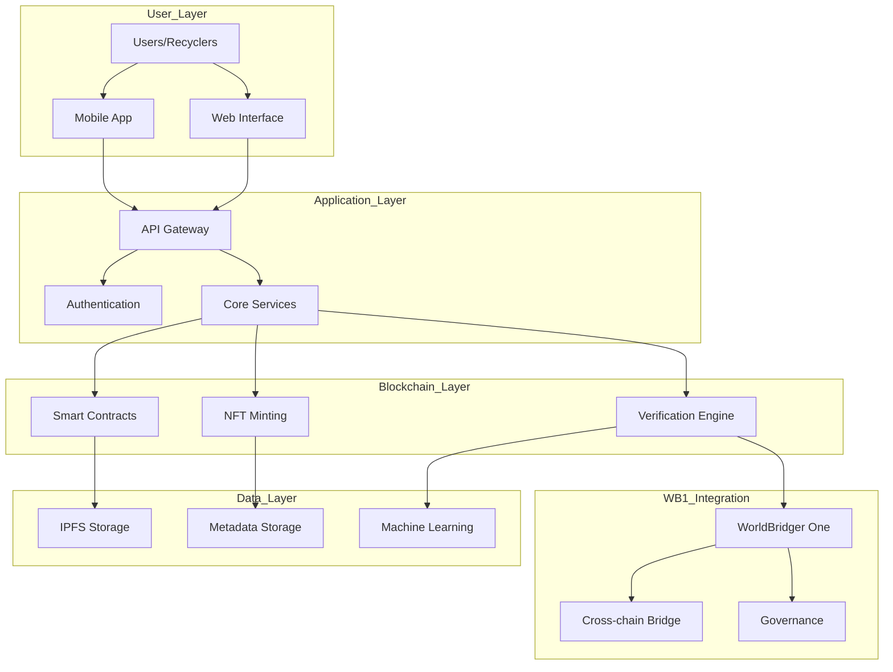
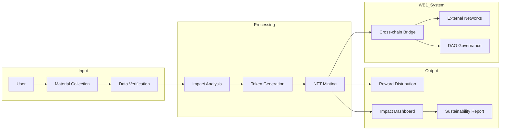

# EcoOps & WorldBridger One (WB1) Integration
## Safety, Sustainability, and Blockchain Innovation

### Core Vision
EcoOps integrates with WorldBridger One to create a sustainable, transparent, and energy-conscious blockchain ecosystem that bridges traditional recycling operations with Web3 technologies.

### Safety & Compliance Commitments

#### 1. Environmental Safety
- **Energy Monitoring**: Real-time tracking of blockchain operations' energy consumption
- **Carbon Offsetting**: Automatic carbon credit generation for recycling activities
- **Impact Reporting**: Transparent environmental impact dashboards

#### 2. Data Safety & Privacy
- **Zero-Knowledge Proofs**: Protecting user privacy while maintaining transparency
- **Decentralized Identity**: Self-sovereign identity management for recyclers
- **GDPR Compliance**: Full compliance with global data protection standards

#### 3. Operational Safety
- **Smart Contract Auditing**: Regular third-party security audits
- **Multi-sig Operations**: Required for critical system changes
- **Emergency Shutdown**: Circuit breakers for critical system components

### WorldBridger One Integration

#### Core Features
1. **Decentralized Verification**
   - Proof of Recycling (PoR) consensus mechanism
   - Automated material tracking and verification
   - Cross-chain interoperability protocols

2. **NFT Achievement System**
   - Environmental Impact Badges
   - Community Contribution Tokens
   - Skill Certification NFTs
   - Event Participation POAPs

3. **Sustainability Metrics**
   - Real-time energy usage monitoring
   - Carbon footprint tracking
   - Community impact scoring

### System Architecture

### Data Flow Diagram

### Feature Roadmap

#### Phase 1: Foundation
- [ ] User registration and KYC
- [ ] Basic material tracking
- [ ] Simple NFT minting
- [ ] Energy usage monitoring

#### Phase 2: WB1 Integration
- [ ] Cross-chain bridge implementation
- [ ] Governance token distribution
- [ ] Advanced verification systems
- [ ] Sustainability metrics

#### Phase 3: Advanced Features
- [ ] AI-powered material recognition
- [ ] Automated impact assessment
- [ ] Dynamic NFT evolution
- [ ] Carbon credit generation

### Safety Protocols

1. **Smart Contract Safety**
   - Formal verification
   - Bug bounty program
   - Time-locked upgrades
   - Multi-signature requirements

2. **Data Protection**
   - End-to-end encryption
   - Decentralized storage
   - Privacy-preserving computations
   - Regular security audits

3. **Operational Security**
   - Role-based access control
   - Real-time monitoring
   - Automated threat detection
   - Regular penetration testing

### Regulatory Compliance

1. **Environmental Regulations**
   - EPA standards compliance
   - International waste management guidelines
   - Carbon credit verification

2. **Financial Regulations**
   - AML/KYC compliance
   - Token classification standards
   - Cross-border transaction monitoring

3. **Data Protection**
   - GDPR compliance
   - CCPA alignment
   - Data sovereignty respect

### Community Governance

1. **DAO Structure**
   - Token-based voting
   - Proposal submission
   - Treasury management
   - Emergency response

2. **Incentive Alignment**
   - Staking rewards
   - Impact-based bonuses
   - Community contributions
   - Educational initiatives

### Future Vision

The integration of EcoOps with WorldBridger One aims to:
1. Reduce global carbon footprint through incentivized recycling
2. Create transparent and verifiable impact metrics
3. Build a sustainable blockchain ecosystem
4. Foster community-driven environmental initiatives
5. Bridge traditional and Web3 environmental solutions

This system represents a paradigm shift in how we approach environmental sustainability, combining the best of blockchain technology with real-world impact measurement and community engagement.
